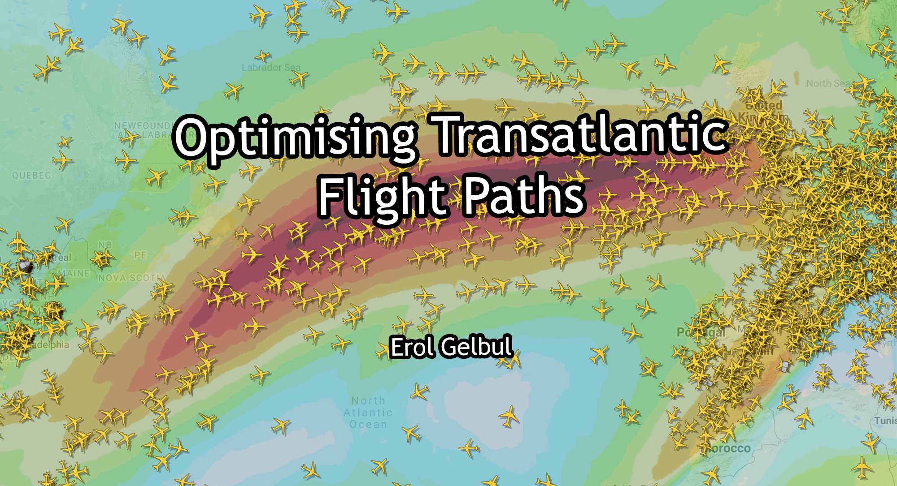

<div id="top"></div>

<div style="text-align:center"></div>

<!-- ABOUT THE PROJECT -->
## Optimising Transatlantic Flight Paths

This project is my dissertation which got me a first-class. Markdown will only be explaining how to set up the files and I will present the abstract.
If you would like to learn more about the project, then please, head over to my [blog post](https://erolgelbul.com/project-blog/optimising-transatlantic) for an in-depth explanation on the project. My paper is also available on the post.

<!-- ABSTRACT -->
## Abstract

This report describes the development of an algorithm to optimize the transatlantic flight route from North America to Europe. The project aims to identify the factors that affect this travel corridor, including weather conditions, transatlantic wind maps, turbulence, and airplane statistics.

The project begins with an exploration phase that calculates the distance of the great circle route. Various trigonometric methodologies involving spherical and geodesic mathematics are introduced, and the most suitable methodology is selected. After calculating the flight path's distance, a simulation is conducted to optimize the flight path by adjusting the plane's course to take advantage of tailwinds and avoid headwinds, resulting in a faster arrival at the destination.

The final algorithm outputted a flight path that reduced flight time by 6.2 minutes compared to the regular great circle route. This optimization resulted in a profit of $3,170.34 for the airline company.

<!-- ABSTRACT -->
## Getting Started

Before forking the files, please, make sure you have pyton3 and MATLAB installed. MATLAB is not free, therefore, you may need to get a license. If you own a license,
please follow to MATLAB's website. The project does use additional MATLAB libraries, although if you would like to see the simulation in real-time, make sure you have MATLAB 2021b or above installed.

* [MATLAB](https://uk.mathworks.com/products/matlab.html)
* [python3](https://www.python.org/)

**How to install Python 3**

Links:
- [Python](https://python.org/) homepage
- [Python docs](https://docs.python.org/)


How to install:

- Debian/Ubuntu
    1. Install using [apt-get](https://linux.die.net/man/8/apt-get).
        ```sh
        $ sudo apt-get update
        $ sudo apt-get install python3
        ```
- macOS
    1. Install [Brew](https://brew.sh).
    2. Install Python using Brew.
        ```sh
        $ brew install python3
        ```
- Windows
    1. Download Python from the [Windows Download](https://www.python.org/downloads/windows/) page.
    2. Run the installer.
        - Be sure to _check_ the box to have Python added to your PATH if the installer offers such an option (it's normally off by default).

For more details, see this gist - [Set up a Python 3 virtual environment](https://gist.github.com/MichaelCurrin/3a4d14ba1763b4d6a1884f56a01412b7).


<!-- SET-UP -->
## Setting up MATLAB

1. Download project files.
2. Run MATLAB.
3. On the left pane, go to the directory where the project files are located.
4. Launch all of the MATLAB project files on the editor by double clicking on each of them.
5. Make sure you are on `Path_Optimisation_Gelbul.m` file on the editor.
6. To see each section one by one, use the `Run Section` button, simply press `CTRL + ENTER`.
7. After running the first section, a panel should appear with the title Figure 1, where you will be able to see the changes.


<p align="right">(<a href="#top">back to top</a>)</p>


<!-- CONTRIBUTING -->
## Contributing

If you would like to add any extra features to the optimisation simulation, feel free to fork and create a pull request. Thank you!

1. Fork the Project
2. Create your Feature Branch (`git checkout -b feature/AmazingFeature`)
3. Commit your Changes (`git commit -m 'Add some AmazingFeature'`)
4. Push to the Branch (`git push origin feature/AmazingFeature`)
5. Open a Pull Request

<p align="right">(<a href="#top">back to top</a>)</p>


<!-- CONTACT -->
## Contact

Erol Gelbul - [Website](http://www.erolgelbul.com) - erolgelbul@gmail.com

Project Link: [Flight Path Optimisation](https://github.com/ErolGelbul/flight_path_optimisation)

<p align="right">(<a href="#top">back to top</a>)</p>


<!-- ACKNOWLEDGMENTS -->
## Acknowledgments

I would like to thank my university for the MATLAB license, and special thanks to my supervisor, Stephen Hunt, for his time and help. 

<p align="right">(<a href="#top">back to top</a>)</p>


